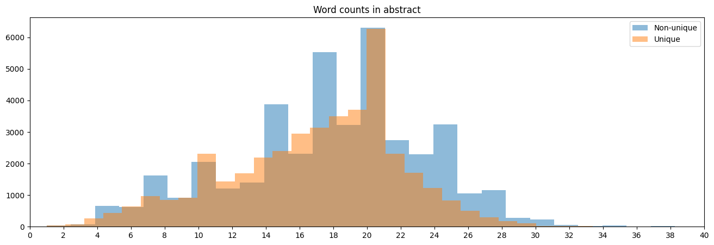
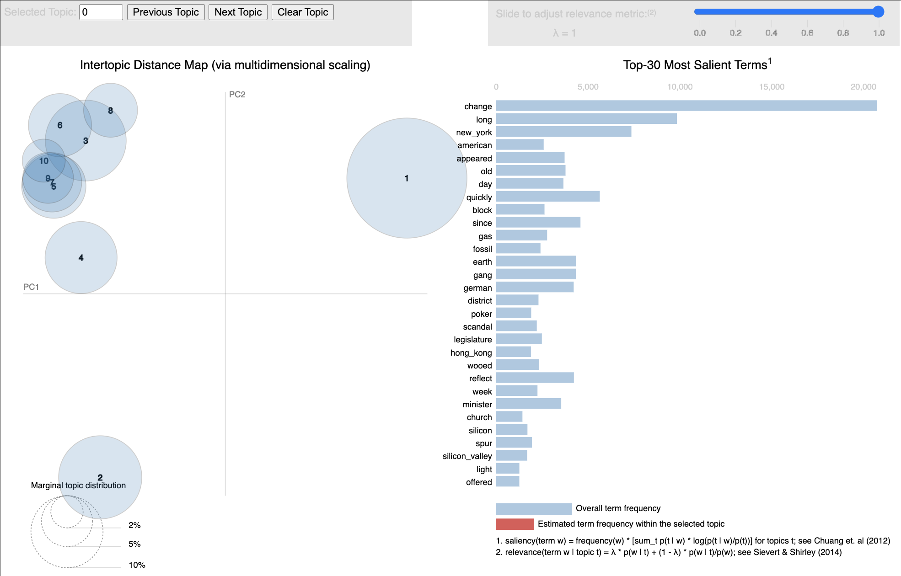
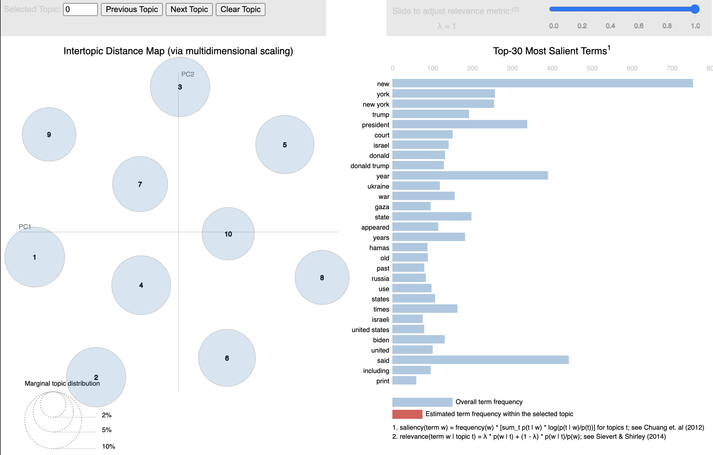
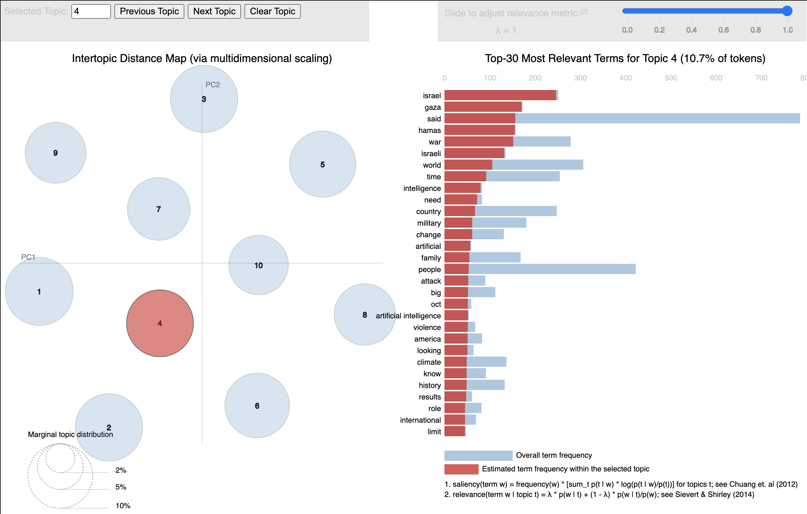
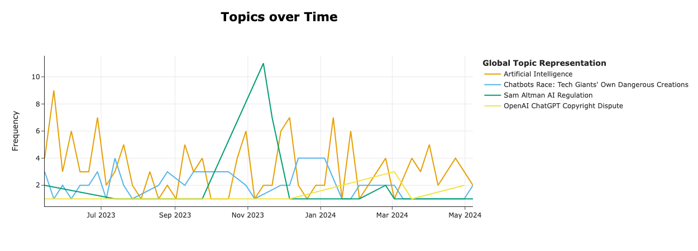
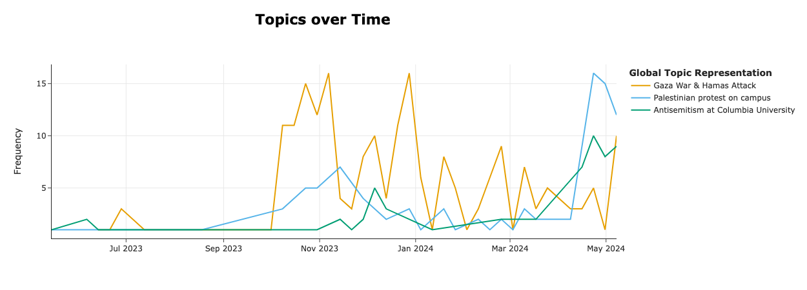

# Topic recognition on New York Times articles

</img>&nbsp;&nbsp;</img>

Project created by Ravi Tripathi, Touseef Haider, Ping Wan, Schinella D'Souza, Alessandro Malusà, and Craig Franze for the Erdős Institute Data Science bootcamp, May-Summer 2024 Cohort, mentored by Matthew Graham. Data provided by The New York Times.

### Goals

Analyze New York Times articles by topic and explore applications such as
- Building a recommendation system based on topic similarity;
- Analyzing correlations between topics;
- Verifying accuracy of keywords and/or suggesting additional ones;
- Evaluating trends in topic frequency.

### Stakeholders

As stakeholders for this project, we envision our team members (Ravi Tripathi, Touseef Haider, Ping Wan, Schinella D'Souza, Alessandro Malusà, Craig Franze) and the New York Times, or potentially any online news platform.

### Key performance indicators

In the models we implemented, a topic is represented as a collection of words, each with a weight expressing its relevance, or the probability of it being used in an article about the given topic. KPIs for the detection of topics from the document collection are then:
- Sparsity/separation of the topics, viewed as vectors of weights;
- Recognizability of a topic from the list of most relevant words;
- Perplexity, a metric that measures how "surprised" a trained probability model is when presented with new data points.

KPIs for the assignment of topics to individual documents include:
- Ability to recognize similar topics from separate parts of the same article;
- Consistency of topics detected with titles and keywords.

Given the time constraint on this project, we focused primarily on the distribution of topics in the collection.

## Methods

We used two main methods for topic recognition: Latent Dirichlet Allocation (LDA) and Bidirectional Encoder Representations from Transformers (BERT).  
Both models describe a topic as a collection of words with attached weights, the latter expressing how relevant a word is for a given topics, or the probability of it being used in an article on that subject. In particular, neither model is capable of recognizing what the topic is about, nor of suggesting meaningful labels. The optimal number of topics to identify was determined through cross-validation using log-likelihood as metric for LDA, and detected automatically for BERT.  
Besides the word-per-topic distribution, these models also provide topic-per-document weights. This can be used to measure topic-similarity between articles by measuring how similar these distributions are. In more technical terms, one may regard two weight distributions as vectors in an appropriate space, and regard the corresponding articles as similar if the anlge between these vectors is small. We based our recommender on this idea.

## Data

The dataset we used was obtained from The New York Times via their official API. We considered all available metadata of articles published between May 15th, 2023 and Mat 14th, 2024, for a total of about 42,000 data points. We identified a few fields that seemed to lend themselves to the task and chose for simplicity to focus on one, the abstract.  
During data exploration we identified two major classes of articles with nearly identical abstracts and no discernible topics, which we discarded alongside data points with invalid abstracts. We then split each abstract into individual words (or *tokens*), including acronyms and year dates, and then disregarded all non-acronym words below three characters in length. We also analyzed the word count distribution after the cleaning process to decide whether to eliminate articles below a certain length.

The code we used for scraping and preprocessing the data can be found in our [preprocessing Jupyter notebook](Notebooks/preprocessing.ipynb).

## LDA approach

LDA is a *generative statistical model*, which means it bases its predictions on the assumption that documents are generated by a certain randomized procedure, and proceeds by reverse-engineering the parameters of this process based on the provided data. More specifically, these parameters would be the word-per-topic and topic-per-document weight distributions.  
In our project, we applied this scheme to the metadata of New York Times articles. We used cross validation to estimate the optimal number of topics (10) and of words per topic (30). We also experimented with two different implementations of this, from the Gensim and scikit-learn (sklearn) libraries.  
The topics found by the Gensim implementation, which can be found in [this notebook](Notebooks/lda_gensim_model.ipynb), appear to have significant overlaps, as can be seen in the following graphic.
  
The sklearn model, however, seems to perform better. As can be seen in [this notebook](Notebooks/sklearn_model.ipynb) and in the graphics below, the topics detected by this model are much more sparse, and the keywords within each topic seem to arise from rather discernible subjects of discussion.
  

Given the better performance, we used the latter model to implement a rudimentary recommendation system based on topic cosine similarity.

## BERT approach

BERTopic is a topic recognition model that uses sentence transformers to embed our documents into a high dimensional space. Then UMAP reduces the dimensionality for clustering, and HDBSCAN performs hierarchical clustering on the data.  
The representative documents from the identified clusters, or topics, from BERTopic were then fed into a large language model, Ollama, to generate short sensible labels. The model identified [420 emergent topics](BERT_trends/short_ollama_labels.txt) over the past year and produces time series for those topics to show their popularity over time.  
  
  
Investigate these trends for yourself [here](https://nytimestrends.streamlit.app/)! Further information on this approach can be found in the [Dynamic BERTopic notebook](Notebooks/dynamicBERTopic.ipynb).

## Future directions

Our project could be continued in a number of ways given the appropriate amount of time and resources. Possible improvements include:
- Exploring other fields available in the metadata, such as `'lead_paragraph'`, and analyze the results in comparison to those obtained thus far;
- Refining our tokenization and lemmatization processes, e.g. to better detect acronyms and identify stop words more accurately;
- Adjusting the many hyperparameters available in LDA and BERT, e.g. the criteria for which words to include in the vocabulary;
- Further analyzing the performance of our model by including additional metrics to the validation;
- Further investigating validation of our model, e.g. by testing it against more recent data than those used for training;
- Developing a user interface for the recommender;
- Implementing a version of the recommender that offers multiple options and uses the history of choices made to improve its suggestions.

Additionally, our recommender could be further improved by combining it with analysis of additional data. If given access to data on article popularity, content consumption, and perhaps user demographic and preferences, this information could be combined with topic similarity to build a more robust recommendation system.

## Acknowledgements 

We thank the Erdős Institute for the opportunity and training, our mentor Matthew Graham for providing us with valuable insights and encouragement, and to the New York Times for access to their API and metadata. 
